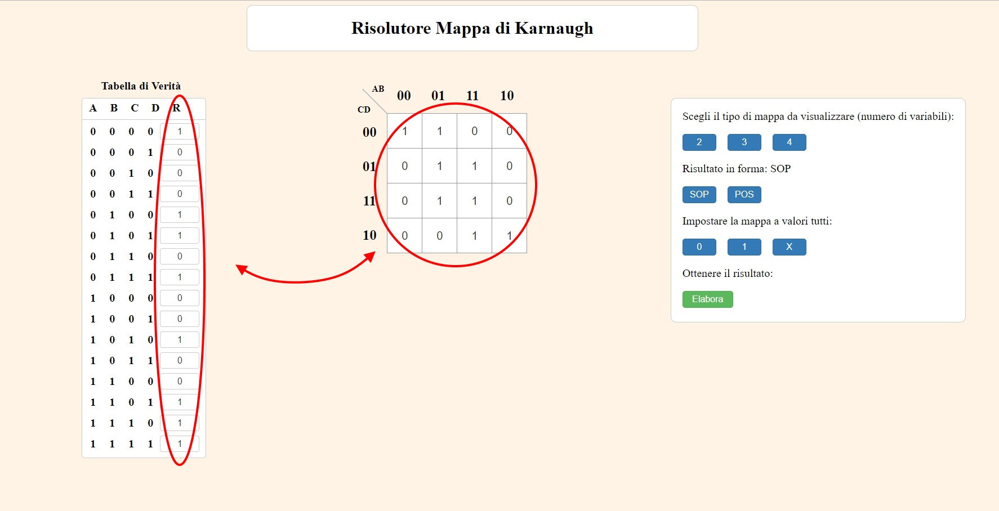
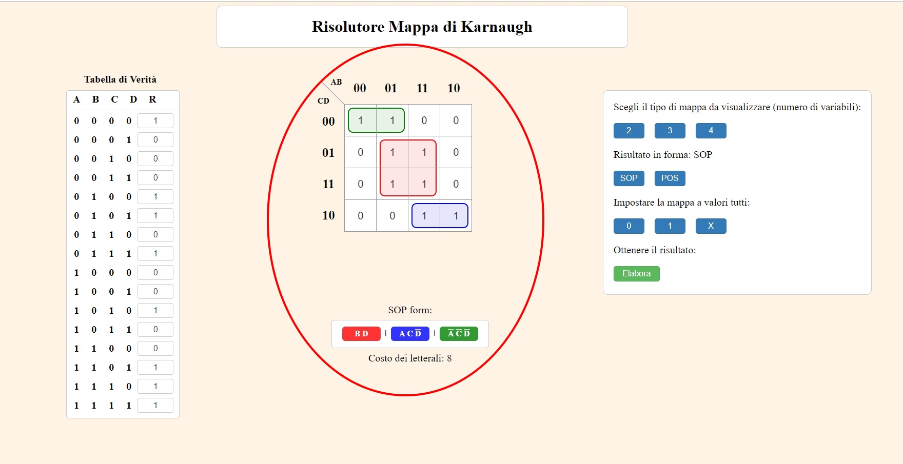

## Karnaugh Map Solver
[Click here to open demo](https://warcreed.github.io/Karnaugh-Map-Solver/ "Demo Mappa Di Karnaugh")

>The Karnaugh map (KM or K-map) is a method of simplifying Boolean algebra expressions. The Karnaugh map reduces the need for extensive calculations by taking advantage of humans' pattern-recognition capability. It also permits the rapid identification and elimination of potential race conditions.

Source: [Wikipedia](https://en.wikipedia.org/wiki/Karnaugh_map "Karnaugh map")

## User Guide

### Introduction

_Karnaugh maps solver_ is a web app that takes the truth table of a function as input, transposes it onto the respective Karnaugh map and finds the minimum forms SOP and POS according to the visual resolution method by Maurice Karnaugh, American physicist and mathematician.

The program is presented as a web app, therefore executable on most of the internet browsers.

### Interface and utilization

The software interface consists of a single main screen, in which all actions can be performed.

It is divided into:

*   Truth table, where it is possible, for each row, pick a value in the set {0,1,X}, which will be reported on the map.
*   Map of Karnaugh, where for each cell, it is possible to modify the internal values between 0, 1 and X, synchronously with the truth table. It will display the groups formed by the calculation of the solution.
*   Selection menu, where you can choose which type of map to display (2, 3 or 4 variables), choose between SOP and POS form, fill the entire map with 0, 1 or X, process the solution according to the chosen criteria.
*   At the bottom of the page the solution will appear, identified by a colour, which is the reduction of the group with the same one in the map.

### Program functioning

It is possible to set {0,1,X} values to every single combination of input both in the truth table and on the map. The table and the map will be synchronized, so that the user is free to choose his own  input method.

You can click the button **Process**, in the setup menu on the right side of the page, when the criteria are set.

  

The solution is shown in the form of different coloured groups, the colour identifies the solution for the corresponding group drawn on the map.

## Installation notes

### Minimum system requirements
The solver can be used online through any browser, it needs [Node.js](https://nodejs.org/en/) to run offline. It is built by using [React.js](https://en.reactjs.org/).

### Installation
*   If [Node.js](https://nodejs.org/it/) is not installed, you need to install it.
*   Open the terminal in the folder where you cloned this project.
*   Type `npm i jquery --save`
### Execution
*   Open the terminal in the folder where you cloned this project.
*   Type in terminal `npm start` and the app will be showed on http://localhost:3000. If nothing appears, just wait for the initialization times.

## Developed by
* [Rosario Scavo](https://github.com/rosarioscavo "Rosario Scavo")
* [Danilo Santitto](https://github.com/Warcreed "Warcreed")
* [Simone Torrisi](https://github.com/Quezal17 "Quezal17")
